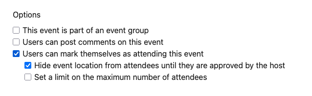
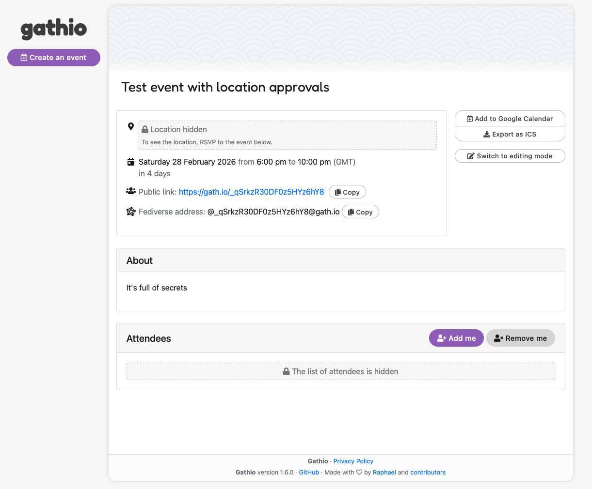
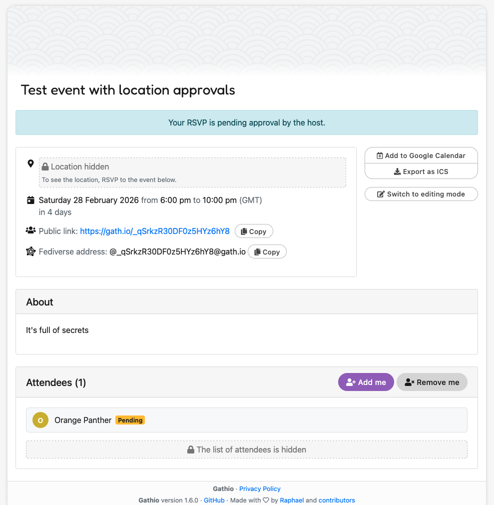
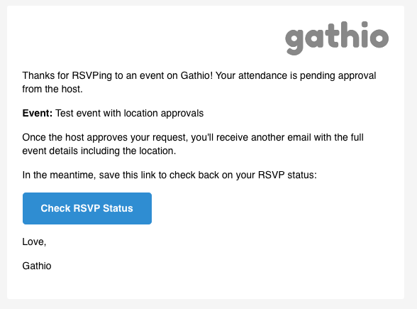
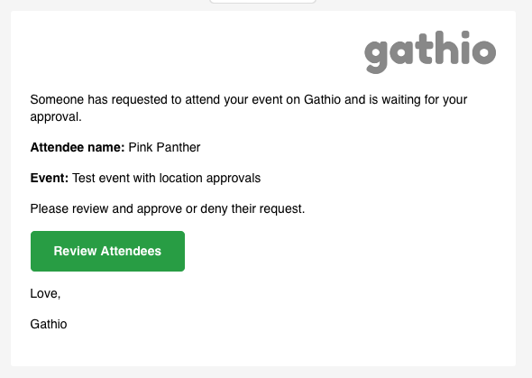
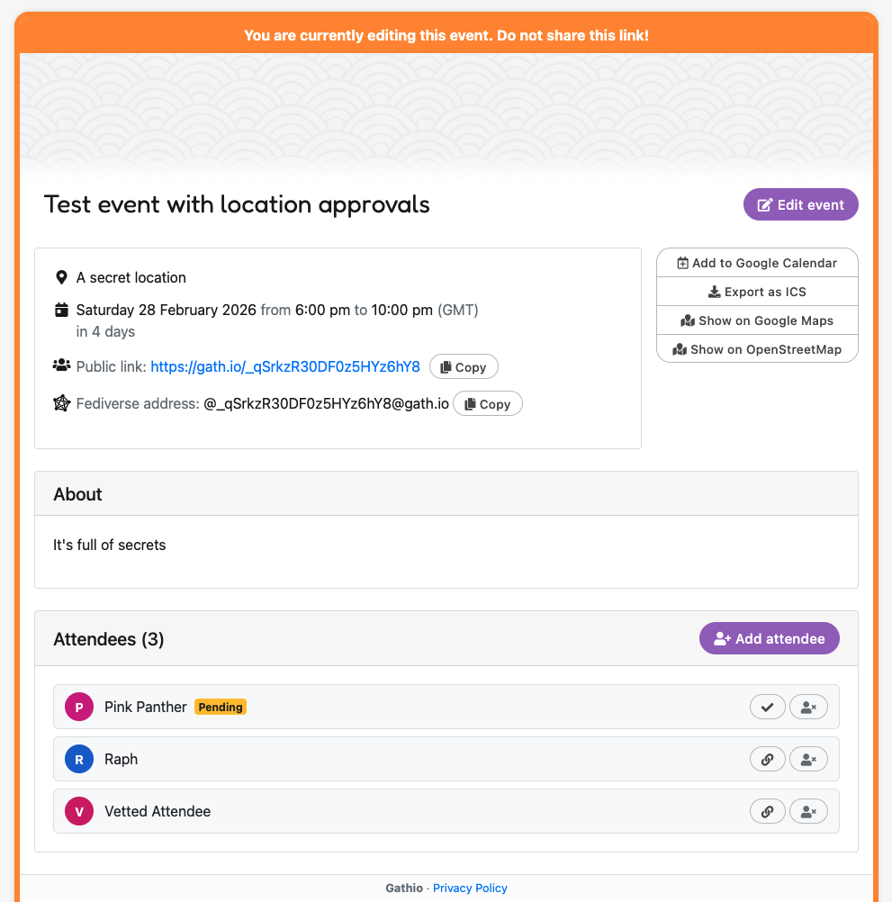
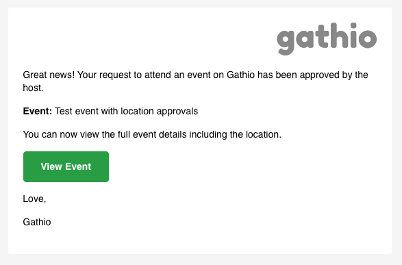
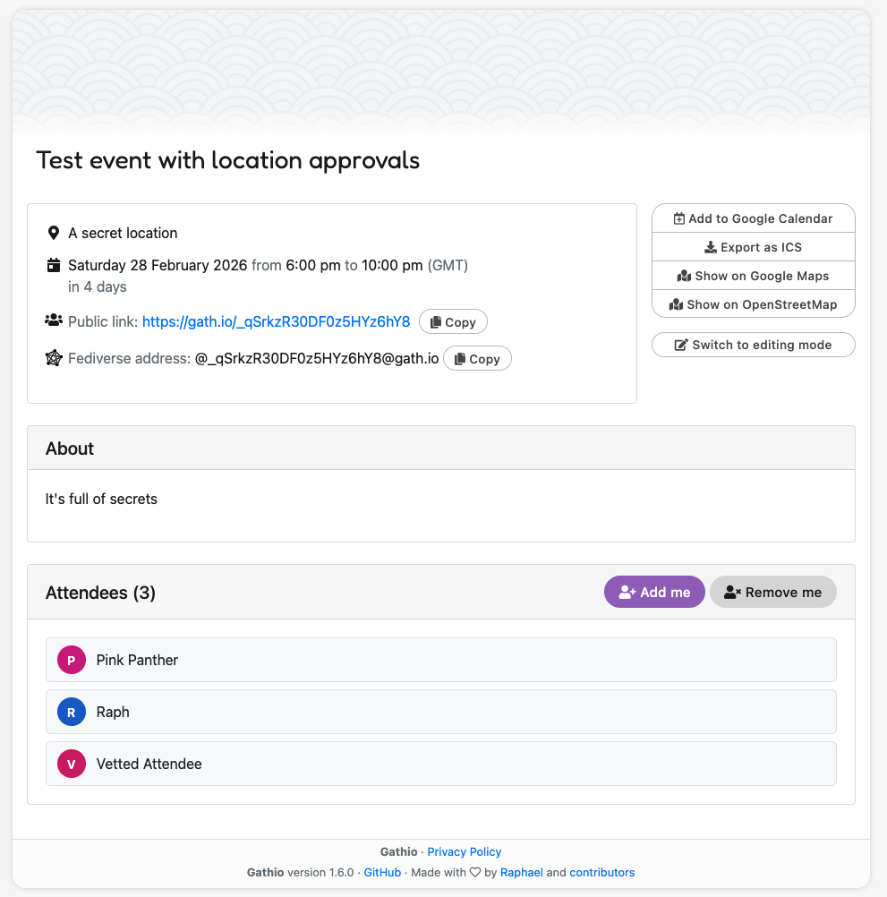

# Attendee approvals

Gathio allows event hosts to hide the event location from attendees until the
host has manually approved them. This is useful for events where you want to
control who can see the venue, such as events at someone's home.

## Enabling attendee approvals

When creating or editing an event, check **Users can mark themselves as
attending this event**, then check the sub-option **Hide event location from
attendees until they are approved by the host**.

## How it works

### What attendees see

When someone visits an event with attendee approvals enabled, the location is
hidden. They'll see a message saying "Location hidden" and a prompt to RSVP to
see the location.

After RSVPing, the attendee sees a banner confirming their RSVP is pending
approval from the host. Their name appears in the attendee list with a
**Pending** badge. The location remains hidden until the host approves them.

### Email notifications

The attendee receives an email confirming their RSVP is pending. The email
includes a link to check back on their RSVP status.

The host receives an email notifying them that someone has requested to attend
and is waiting for approval, with a link to review attendees.

### Approving or rejecting attendees

On the event's editing page, the host can see all attendees. Pending attendees
are highlighted and can be approved or rejected using the action buttons next to
their name.

When the host approves an attendee, the attendee receives an email letting them
know they've been approved and can now view the full event details, including
the location.

### After approval

Once approved, the attendee can see the full event page with the location
visible.

